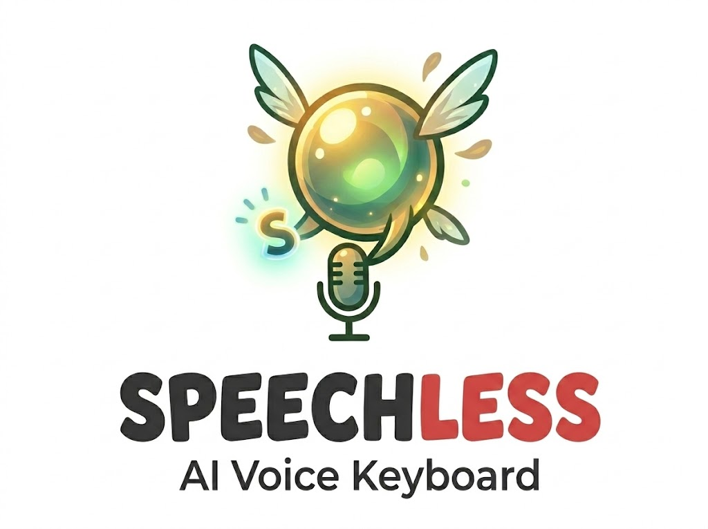

<a name="readme-top"></a>

<div align="center">
  <picture>
    <source media="(prefers-color-scheme: dark)" srcset="assets/cover_dark.png">
    <source media="(prefers-color-scheme: light)" srcset="assets/cover.png">
    
  </picture>
  <h1 align="center">🧚 Speechless - AI Voice Dictation Keyboard</h1>
</div>

<div align="center">
  <a href="https://discord.com/invite/WVBeWsNXK4"></a>
  <hr>
</div>

Welcome to Speechless, an **open-source, offline speech-to-text keyboard** built for **speed, privacy, and extensibility!**

> 😡*Tired of paying for AI voice dictation tools? Frustrated by network latency? Worried about privacy of cloud service?* — **Just get rid of them and download Speechless APP!**

Press a shortcut, speak, and have your words appear in any text field—**all without sending your voice to the cloud!**

speechless is a cross-platform desktop application built with Tauri (Rust + React/TypeScript), a fork of the [Handy](https://github.com/cjpais/Handy) project. We are deeply grateful to [cjpais](https://github.com/cjpais) and the original contributors for building such a solid foundation.

**Note**: Speechless is part of **Navi**, an open-source ecosystem of practical voice agent projects. More coming soon!

## ✨ Why speechless?

To fill the gap for a truly open source, extensible speech-to-text tool.

- 💰 **Free**: Accessibility tooling belongs in everyone's hands, not behind a paywall
- 📖 **Open Source**: Together we can build further. Extend speechless for yourself and contribute to something bigger
- 🔒 **Private**: Your voice stays on your computer. Get transcriptions without sending audio to the cloud
- 🎯 **Simple**: One tool, one job. Transcribe what you say and put it into a text box
- 🧠 **Curated Models**: Pick between word-for-word transcription or LLM-powered text polishing from carefully selected models

speechless aims to be the most forkable and user-friendly speech-to-text tool.

## 🚀 How It Works

1. ⌨️ **Press** a configurable keyboard shortcut to start/stop recording (or use push-to-talk mode)
2. 🎤 **Speak** your words while the shortcut is active
3. ⏹️ **Release** and speechless processes your speech using CPU-optimized models
4. 📋 **Get** your transcribed text pasted directly into whatever app you're using
5. ⚙️ **(Optional)** You can choose between faithful dictation or LLM-powered text polishing in the settings.

The process is entirely local:

- 🔇 Silence is filtered using VAD (Voice Activity Detection) with Silero
- 📝 Transcription uses CPU-optimized models with excellent performance and automatic language detection
- 🖥️ Works on Windows, macOS, and Linux

## ⚡ Quick Start

### 📦 Installation

1. Download the latest release from the [releases page](https://github.com/navi-bot/Speechless/releases)
2. Install the application
3. Launch speechless and grant necessary system permissions (microphone, accessibility)
4. Configure your preferred keyboard shortcuts in Settings
5. Start transcribing!

### 🔧 Development Setup

For detailed build instructions including platform-specific requirements, see [BUILD.md](BUILD.md).

## 🏗️ Architecture

speechless is built as a Tauri application combining:

- 🎨 **Frontend**: React + TypeScript with Tailwind CSS for the settings UI
- ⚙️ **Backend**: Rust for system integration, audio processing, and ML inference
- 📚 **Core Libraries**:
  - `sherpa-rs`: Fast, CPU-optimized speech recognition
  - `navi-llm`: Local LLM inference engine supporting GGUF models (via `llama-cpp`) for post-processing and chat
  - `cpal`: Cross-platform audio I/O
  - `vad-rs`: Voice Activity Detection
  - `rdev`: Global keyboard shortcuts and system events
  - `rubato`: Audio resampling

### 🤖 Local LLM Integration (navi-llm)

speechless includes **navi-llm**, a powerful local inference engine that allows you to:

- 🔒 Run GGUF models locally for maximum privacy
- ✏️ Perform advanced post-processing on transcriptions (e.g., grammar correction, summarization)
- 🤖 Interact with local AI models without any cloud dependency
- 💬 Support for system prompts and multi-turn conversations

### 🐛 Debug Mode

speechless includes an advanced debug mode for development and troubleshooting. Access it by pressing:

- 🍎 **macOS**: `Cmd+Shift+D`
- 🖥️ **Windows/Linux**: `Ctrl+Shift+D`

### ⌨️ CLI Parameters

speechless supports command-line flags for controlling a running instance and customizing startup behavior. These work on all platforms (macOS, Windows, Linux).

**Remote control flags** (sent to an already-running instance via the single-instance plugin):

```bash
speechless --toggle-transcription    # Toggle recording on/off
speechless --toggle-post-process     # Toggle recording with post-processing on/off
speechless --cancel                  # Cancel the current operation
```

**Startup flags:**

```bash
speechless --start-hidden            # Start without showing the main window
speechless --no-tray                 # Start without the system tray icon
speechless --debug                   # Enable debug mode with verbose logging
speechless --help                    # Show all available flags
```

Flags can be combined for autostart scenarios:

```bash
speechless --start-hidden --no-tray
```

## ⚠️ Known Issues & Current Limitations

This project is actively being developed and has some known issues. We believe in transparency about the current state:

### 🚨 Major Issues (Help Wanted)

**Wayland Support (Linux):**

- Limited support for Wayland display server
- Requires [`wtype`](https://github.com/atx/wtype) or [`dotool`](https://sr.ht/~geb/dotool/) for text input to work correctly (see [Linux Notes](#linux-notes) below for installation)

### 🐧 Linux Notes

**Text Input Tools:**

For reliable text input on Linux, install the appropriate tool for your display server:

| Display Server | Recommended Tool | Install Command                                    |
| -------------- | ---------------- | -------------------------------------------------- |
| X11            | `xdotool`        | `sudo apt install xdotool`                         |
| Wayland        | `wtype`          | `sudo apt install wtype`                           |
| Both           | `dotool`         | `sudo apt install dotool` (requires `input` group) |

- 🖥️ **X11**: Install `xdotool` for both direct typing and clipboard paste shortcuts
- 🪟 **Wayland**: Install `wtype` (preferred) or `dotool` for text input to work correctly
- ⚙️ **dotool setup**: Requires adding your user to the `input` group: `sudo usermod -aG input $USER` (then log out and back in)

**Other Notes:**

- 📦 **Runtime library dependency (`libgtk-layer-shell.so.0`)**:
  - speechless links `gtk-layer-shell` on Linux. If startup fails with `error while loading shared libraries: libgtk-layer-shell.so.0`, install the runtime package for your distro.
- 🪟 The recording overlay is disabled by default on Linux because certain compositors treat it as the active window.
- ⌨️ **Global keyboard shortcuts (Wayland):** On Wayland, system-level shortcuts must be configured through your desktop environment or window manager. Use the [CLI flags](#cli-parameters) as the command for your custom shortcut.

### 📱 Platform Support

- 🍎 **macOS (both Intel and Apple Silicon)**
- 🪟 **x64 Windows**
- 🐧 **x64 Linux**

### 💻 System Requirements/Recommendations

**CPU-only operation** - runs on a wide variety of hardware

- 📊 **Minimum**: Intel Skylake (6th gen) or equivalent AMD processors
- 🌐 **Automatic language detection** - no manual language selection required

## 🔧 Troubleshooting

### 📥 Manual Model Installation

If you're behind a proxy, firewall, or in a restricted network environment where speechless cannot download models automatically, you can manually download and install them.

#### Step 1: Find Your App Data Directory

The typical paths are:

- 🍎 **macOS**: `~/Library/Application Support/com.navi-bot.speechless/`
- 🪟 **Windows**: `C:\Users\{username}\AppData\Roaming\com.navi-bot.speechless\`
- 🐧 **Linux**: `~/.config/com.navi-bot.speechless/`

#### Step 2: Create Models Directory

Inside your app data directory, create a `models` folder if it doesn't already exist.

### 🤝 How to Contribute

1. 🔀 **Fork the repository** and create a feature branch
2. ✅ **Test thoroughly** on your target platform
3. 📤 **Submit a pull request** with clear description of changes

The goal is to create both a useful tool and a foundation for others to build upon—a well-patterned, simple codebase that serves the community.

## 🔗 Related Projects

- **[Handy](https://github.com/cjpais/Handy)** - The original project speechless is forked from.

## 📄 License

MIT License - see [LICENSE](LICENSE) file for details.

## 🙏 Acknowledgments

- 🎯 **Handy** for the original project and inspiration.
- 🎤 **Sherpa-ONNX** for providing fast and accurate offline speech recognition.
- 🔇 **Silero** for great lightweight VAD
- 🦀 **Tauri** team for the excellent Rust-based app framework
- 👥 **Community contributors** helping make speechless better
